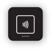
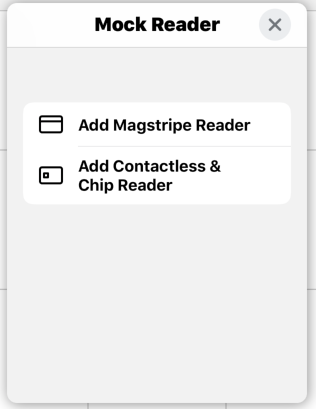

# Reader SDK 2.0 (Alpha 9) iOS Quick Start

This guide will show you how to run the Reader SDK 2.0 sample app and take a payment using a Square reader.

## Step 1 Install the SDK and Sample App
Follow the installation instructions in [README.md](README.md)

## Step 2: Obtain Square Application Credentials
1. Open the [Square Application Dashboard](https://squareup.com/signup?v=developers). You will be prompted to login or create a new account.
2. Create a new Square application and call it "Reader SDK 2 Quick Start".
3. Click on the "Reader SDK 2 Quick Start" app to bring up your Square application settings pages.
4. On the application settings page, there is a toggle towards the top of the screen to toggle between sandbox and production. Select production settings to use real readers and select sandbox settings to use mock readers.


Keep this page open in your browser. You will need the following pieces of information in order to configure the sample app:
1. Square application ID (from the Credentials tab)
2. Personal access token (from the Credentials tab)
3. Location ID (from the Locations tab)

## Step 3: Configure the Sample App
1. Open `ReaderSDK2.xcworkspace`
2. Open `Config.swift` and paste in your Square application ID, personal access token and locationID.

```
// Config.swift


enum Config {
     static let squareApplicationID: String = ""

    // In a production application you should use your server to obtain an access token and locationID.
    // For this sample app, we can just authorize Reader SDK using hardcoded values.
     static let accessToken: String = ""
     static let locationID: String = ""
}

```

Note: **Do not** deploy an app into production that contains your Personal Access Token. For a secure authorization implementation you should implement OAuth instead of hardcoding a Personal Access Token.

## Running the Sample App

1. Build and run the SampleApp scheme. Note that real Square readers only work with real iOS device.
2. When the application launches, grant the required system permissions and tap the ‘Log In’ button to authorize Reader SDK using the access token and locationID that you hardcoded in step 3.
3. Before you can take a payment you will need to connect a Square reader. If you have a magstripe reader you can plug it in now. If you are testing with a Contactless and Chip reader, navigate to the ‘Readers’ tab and tap Connect a Reader.
4. Navigate to the ‘Keypad’ tab
5. Enter an amount and tap Charge.
6. Swipe, insert or tap your card to pay. 
7. Once the payment flow dismisses, tap the ‘View Receipt’ button to display information about the completed payment.
8. (Optional) Go to Square Dashboard to refund the payment if using real reader.

Note: You can use the Settings tab to modify payment options and change the payment flow theme.

## Using a Mock Reader

The mock reader allows for simulating a physical reader when one is not present. This feature is only available with the sandbox application id. 

### Adding a Mock Reader
1. Configure the Sample app with sandbox settings in [Step2](#step-1-install-the-sdk-and-sample-app) and [Step3](#step-3-configure-the-sample-app)
2. After being signed in with sandbox Square ApplicationID, you should  now see a floating action button on the screen



3. This button allows you to add a mock magstripe or contactless & chip reader. Once added you can interact with this mock reader in the same manner you would with a reader that is physical.




4. Via the settings screen in the Sample App, the MockReader floating action button can be shown or hidden

### Paying with a Mock Reader
1. Tap charge
2. Tap on the floating action button, and choose an option for a simulated payment. The mock reader will perform the desired operation.

<table>
  <tr>
    <td></td>
    <td></td>
    <td></td>
    <td></td>
</tr>
</table>


### Using Manual Card Entry
An user will be presented with the option to enter the card information manually to process a transaction.


Once tap, the user is shown the screen below in which it can enter the following information:
- card number
- card expiration month (2-digit) & year (2-digit)
- card CVV

<table>
  <tr>
    <td></td>
    <td></td>
</tr>
</table>

After entering all those information, the user can then *charge* the card. At this point, the payment flows like a normal transaction.


